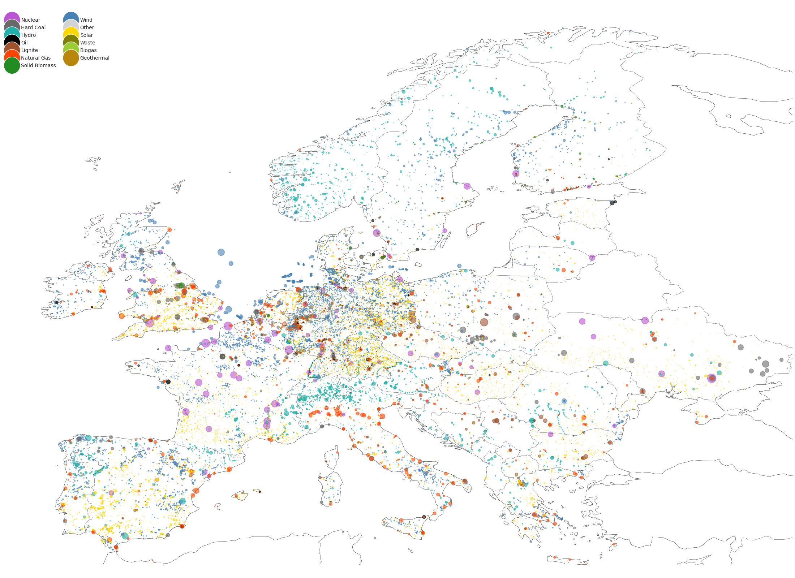

.. powerplantmatching documentation master file, created by
   sphinx-quickstart on Tue Jul 20 21:33:24 2021.
   You can adapt this file completely to your liking, but it should at least
   contain the root `toctree` directive.

Welcome to powerplantmatching's documentation!
==============================================

.. image:: https://img.shields.io/pypi/v/powerplantmatching.svg
    :target: https://pypi.org/project/powerplantmatching/
    :alt: pypi

.. image:: https://img.shields.io/conda/vn/conda-forge/powerplantmatching.svg
    :target: https://anaconda.org/conda-forge/powerplantmatching
    :alt: conda

.. image:: https://img.shields.io/python/required-version-toml?tomlFilePath=https%3A%2F%2Fraw.githubusercontent.com%2FPyPSA%2Fpowerplantmatching%2Fmaster%2Fpyproject.toml
    :alt: pythonversion

.. image:: https://github.com/PyPSA/powerplantmatching/actions/workflows/test.yml/badge.svg
    :target: https://github.com/PyPSA/powerplantmatching/actions/workflows/test.yml
    :alt: Tests

.. image:: https://readthedocs.org/projects/powerplantmatching/badge/?version=latest
    :target: https://powerplantmatching.readthedocs.io/en/latest/
    :alt: doc

.. image:: https://results.pre-commit.ci/badge/github/PyPSA/powerplantmatching/master.svg
    :target: https://results.pre-commit.ci/latest/github/PyPSA/powerplantmatching/master
    :alt: pre-commit.ci status

.. image:: https://img.shields.io/endpoint?url=https://raw.githubusercontent.com/astral-sh/ruff/main/assets/badge/v2.json
    :target: https://github.com/astral-sh/ruff
    :alt: Ruff

.. image:: https://img.shields.io/pypi/l/powerplantmatching.svg
    :alt: LICENSE

.. image:: https://zenodo.org/badge/DOI/10.5281/zenodo.3358985.svg
    :target: https://zenodo.org/record/3358985#.XUReFPxS_MU
    :alt: DOI

.. image:: https://img.shields.io/stackexchange/stackoverflow/t/pypsa
    :target: https://stackoverflow.com/questions/tagged/pypsa
    :alt: Stack Exchange questions

A toolset for cleaning, standardizing and combining multiple power plant
databases.

This package provides ready-to-use power plant data for the European
power system. Starting from openly available power plant datasets, the
package cleans, standardizes and merges the input data to create a new
combining dataset, which includes all the important information. The
package allows to easily update the combined data as soon as new input
datasets are released.

   Map of power plants in Europe

powerplantmatching was initially developed by the `Renewable Energy
Group <https://fias.uni-frankfurt.de/physics/schramm/complex-renewable-energy-networks/>`__
at `FIAS <https://fias.uni-frankfurt.de/>`__ to build power plant data
inputs to `PyPSA <http://www.pypsa.org/>`__-based models for carrying
out simulations for the `CoNDyNet project <http://condynet.de/>`__,
financed by the `German Federal Ministry for Education and Research
(BMBF) <https://www.bmbf.de/en/>`__ as part of the `Stromnetze Research
Initiative <http://forschung-stromnetze.info/projekte/grundlagen-und-konzepte-fuer-effiziente-dezentrale-stromnetze/>`__.

Main Features
~~~~~~~~~~~~~~

-  clean and standardize power plant data sets
-  aggregate power plants units which belong to the same plant
-  compare and combine different data sets
-  create lookups and give statistical insight to power plant goodness
-  provide cleaned data from different sources
-  choose between gros/net capacity
-  provide an already merged data set of six different data-sources
-  scale the power plant capacities in order to match country specific
   statistics about total power plant capacities
-  visualize the data
-  export your powerplant data to a
   `PyPSA <https://github.com/PyPSA/PyPSA>`__ or
   `TIMES <https://iea-etsap.org/index.php/etsap-tools/model-generators/times>`__
   model

Installation
------------

Install the package via pip

.. code:: bash

   pip install powerplantmatching

or conda 

.. code:: bash

   conda install -c conda-forge powerplantmatching
   

Citing powerplantmatching
-------------------------

If you want to cite powerplantmatching, use the following paper

-  F. Gotzens, H. Heinrichs, J. Hörsch, and F. Hofmann, `Performing
   energy modelling exercises in a transparent way - The issue of data
   quality in power plant
   databases <https://www.sciencedirect.com/science/article/pii/S2211467X18301056?dgcid=author>`__,
   Energy Strategy Reviews, vol. 23, pp. 1–12, Jan. 2019.

with bibtex

::

   @article{gotzens_performing_2019,
         title = {Performing energy modelling exercises in a transparent way - {The} issue of data quality in power plant databases},
         volume = {23},
         issn = {2211467X},
         url = {https://linkinghub.elsevier.com/retrieve/pii/S2211467X18301056},
         doi = {10.1016/j.esr.2018.11.004},
         language = {en},
         urldate = {2018-12-03},
         journal = {Energy Strategy Reviews},
         author = {Gotzens, Fabian and Heinrichs, Heidi and Hörsch, Jonas and Hofmann, Fabian},
         month = jan,
         year = {2019},
         pages = {1--12}
   }

and/or the current release stored on Zenodo with a release-specific DOI:

|image1|

Acknowledgements
----------------

The development of powerplantmatching was helped considerably by
in-depth discussions and exchanges of ideas and code with

-  Tom Brown from Karlsruhe Institute for Technology
-  Chris Davis from University of Groningen and
-  Johannes Friedrich, Roman Hennig and Colin McCormick of the World
   Resources Institute

Licence
-------

Copyright 2018-2024 Fabian Gotzens (FZ Jülich), Jonas Hörsch (KIT),
Fabian Hofmann (FIAS)

powerplantmatching is released as free software under the
`GPLv3 <http://www.gnu.org/licenses/gpl-3.0.en.html>`__, see
`LICENSE <LICENSE>`__ for further information.
      

.. toctree::
   :hidden:
   :maxdepth: 2
   :caption: Getting Started

   getting-started
   basics
   example.ipynb
   custom-config

.. toctree::
   :hidden:
   :maxdepth: 2
   :caption: API Reference

   api-data
   api-utils
   api-core

   
.. toctree::
   :hidden:
   :maxdepth: 2
   :caption: References

   release-notes
   contributing
   support

