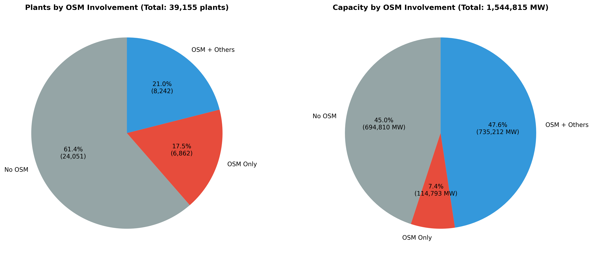
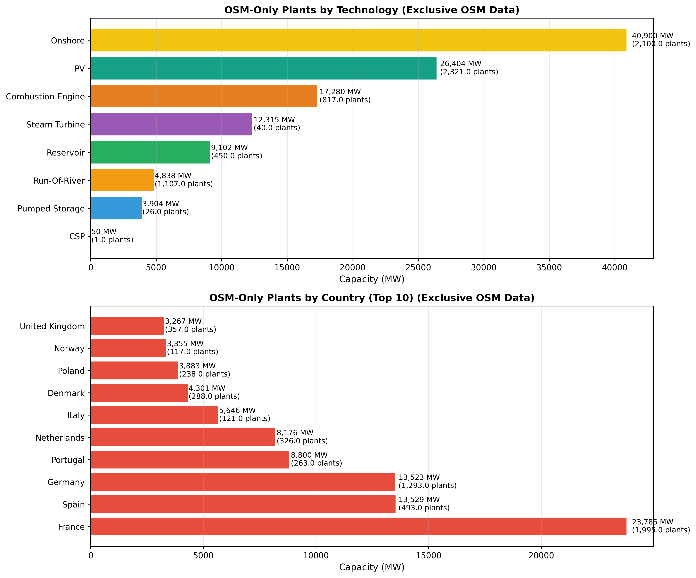
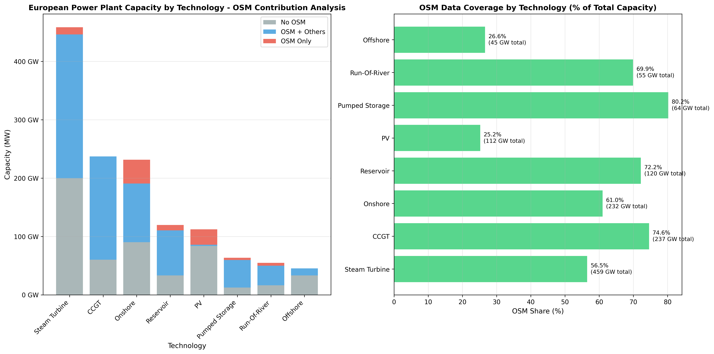

=========================
OSM Data Coverage Analysis
=========================

.. note::
   **Analysis Date**: September 2025

   This analysis is based on powerplantmatching data as of September 2025. Results may change as new power plants are added to the OpenStreetMap database and other data sources are updated.

Overview
--------

This comprehensive analysis evaluates the contribution of OpenStreetMap (OSM) data to the European power plant database within powerplantmatching. The analysis reveals OSM's significant dual role: discovering previously undocumented power plants and validating existing data from other sources.

Key Findings Summary
~~~~~~~~~~~~~~~~~~~

Based on European power plant data analysis:

- **Total Dataset**: 39,155 plants (1,544,816 MW)
- **OSM Contribution**: 15,104 plants (38.6%) with 850,005 MW (55.0%) capacity
- **OSM-Only Plants**: 6,862 plants (17.5%) contributing 114,793 MW (7.4%)
- **OSM-Enhanced Plants**: 8,242 plants (21.0%) contributing 735,212 MW (47.6%)

Interactive Map Visualization
----------------------------

.. raw:: html

   

   

   <iframe src="_static/europe_power_plants_osm_comparison.html"
           frameborder="0"
           scrolling="no">
   </iframe>
   

The interactive map above allows exploration of OSM data contribution across Europe. Use the dropdown menu to switch between different views:

- **OSM Involvement Comparison**: Default view showing OSM-only, OSM-mixed, and non-OSM plants
- **OSM-Only Plants**: Focus on plants discovered exclusively through OSM
- **Reference vs Combined datasets**: Compare data with and without OSM
- **Technology and Fuel breakdowns**: Explore coverage by generation type

Analysis Results
---------------

OSM Involvement Breakdown
~~~~~~~~~~~~~~~~~~~~~~~~~

The analysis reveals three distinct categories of plants:

**No OSM Data (61.4% of plants, 45.0% of capacity)**
   - 24,051 plants (694,810 MW)
   - Average plant size: 28.9 MW
   - Covered entirely by traditional databases

**OSM-Only Data (17.5% of plants, 7.4% of capacity)**
   - 6,862 plants (114,793 MW)
   - Average plant size: 16.7 MW
   - Completely new discoveries from OSM
   - Focus on distributed generation

**OSM + Other Sources (21.0% of plants, 47.6% of capacity)**
   - 8,242 plants (735,212 MW)
   - Average plant size: 89.2 MW
   - OSM validates and enhances existing data
   - Utility-scale infrastructure

OSM-Only Plants Analysis
~~~~~~~~~~~~~~~~~~~~~~~

OSM-only plants represent completely new additions to the European power database. Key characteristics:

**Technology Distribution**
   - **Onshore Wind**: 40,900 MW (35.6% of OSM-only capacity)
   - **Solar PV**: 26,404 MW (23.0% of OSM-only capacity)
   - **Combustion Engine**: 17,280 MW (15.1% of OSM-only capacity)
   - **Steam Turbine**: 12,315 MW (10.7% of OSM-only capacity)
   - **Reservoir Hydro**: 9,102 MW (7.9% of OSM-only capacity)
   - **Run-Of-River**: 4,838 MW (4.2% of OSM-only capacity)
   - **Pumped Storage**: 3,904 MW (3.4% of OSM-only capacity)
   - **CSP**: 50 MW (0.0% of OSM-only capacity)

**Geographic Distribution**
   - **France**: 23,785 MW leading contribution
   - **Spain**: 13,529 MW strong renewable focus
   - **Germany**: 13,523 MW distributed generation
   - **Portugal**: 8,800 MW high penetration rate
   - **Netherlands**: 8,176 MW distributed systems

Technology Coverage Summary
~~~~~~~~~~~~~~~~~~~~~~~~~~

The comprehensive technology analysis shows OSM's varying coverage across different power generation types:

**Highest OSM Coverage (>70% of capacity)**
   - **Pumped Storage**: 80.2% OSM coverage
   - **CCGT**: 74.6% OSM coverage
   - **Reservoir Hydro**: 72.2% OSM coverage
   - **Run-Of-River**: 69.9% OSM coverage

**Moderate OSM Coverage (40-70% of capacity)**
   - **Onshore Wind**: 61.0% OSM coverage
   - **Steam Turbine**: 56.5% OSM coverage

**Growth Opportunities (<40% of capacity)**
   - **Offshore Wind**: 26.6% OSM coverage
   - **Solar PV**: 25.2% OSM coverage
   - **CSP**: 2.1% OSM coverage

Strategic Value Assessment
-------------------------

OSM's Dual Strategic Role
~~~~~~~~~~~~~~~~~~~~~~~~

**1. Discovery Function (OSM-Only: 7.4% capacity)**
   - Identifies 114,793 MW of previously undocumented capacity
   - Specializes in distributed generation (16.7 MW average size)
   - Strong coverage of small-scale renewables and industrial plants
   - Particularly valuable for wind, solar, and combustion engine facilities

**2. Validation Function (OSM-Mixed: 47.6% capacity)**
   - Validates and enhances 735,212 MW of existing data
   - Focuses on utility-scale infrastructure (89.2 MW average size)
   - Critical for thermal plants, hydro systems, and nuclear facilities
   - Provides multiple-source verification for accuracy

Data Quality Characteristics
~~~~~~~~~~~~~~~~~~~~~~~~~~~

**OSM Data Quality Metrics**
   - **Completeness**: <1% missing data across key fields (0.6% missing names only)
   - **Geographic Coverage**: Complete coordinates for all plants (0.0% missing)
   - **Technology Classification**: Comprehensive coverage across all categories (0.0% missing)
   - **Capacity Information**: Complete capacity data for all plants (0.0% missing)

**Size-Based Specialization**
   - **Distributed Generation**: OSM-only plants average 16.7 MW
   - **Utility Scale**: OSM-mixed plants average 89.2 MW
   - **Clear Complementarity**: Different data sources serve different plant scales

Methodology and Reproducibility
------------------------------

Analysis Methodology
~~~~~~~~~~~~~~~~~~~

The analysis uses consistent classification logic to separate OSM contributions:

1. **Data Filtering**: European bounds (35-71°N, 25°W-45°E) with valid coordinates
2. **OSM Classification**: Projects are classified based on projectID structure
3. **Statistical Analysis**: Comprehensive breakdowns by technology, fuel, and country
4. **Visualization**: Interactive maps and static charts for different perspectives

Creating Your Own Analysis
~~~~~~~~~~~~~~~~~~~~~~~~~

The complete Python script used to generate the interactive map is available for download and customization:

:download:`osm_ppm_eu_analysis.py <_static/osm_ppm_eu_analysis.py>`

**Requirements**:

.. code-block:: bash

   pip install pandas plotly numpy

**Basic Usage**:

.. code-block:: bash

   # Run the analysis
   python osm_ppm_eu_analysis.py

The script generates:

- Interactive HTML map with multiple view options
- Automatic OSM involvement classification
- Hover information with plant details
- Exportable visualizations for reports

The analysis confirms OSM as a critical data source that both discovers missing infrastructure and validates existing information, contributing to over half of European power generation capacity through complementary discovery and enhancement functions.

.. note::
   This analysis will be updated periodically to reflect changes in the underlying data.
   For the most current analysis, regenerate using the provided Python scripts with fresh data exports.

   **Current Analysis**: September 2025 - 39,155 plants, 1,544,816 MW total capacity

References
----------

**Data Sources**:
   - OpenStreetMap power plant data via Overpass API
   - powerplantmatching reference databases (ENTSOE, GEO, OPSD, etc.)

**Analysis Tools**:
   - Python pandas for data processing
   - Plotly for interactive visualizations
   - Matplotlib/Seaborn for static charts

**Geographic Scope**:
   - European coverage: 35-71°N latitude, 25°W-45°E longitude
   - Filtered for valid coordinates and European bounds
   - Comprehensive technology and fuel type coverage
