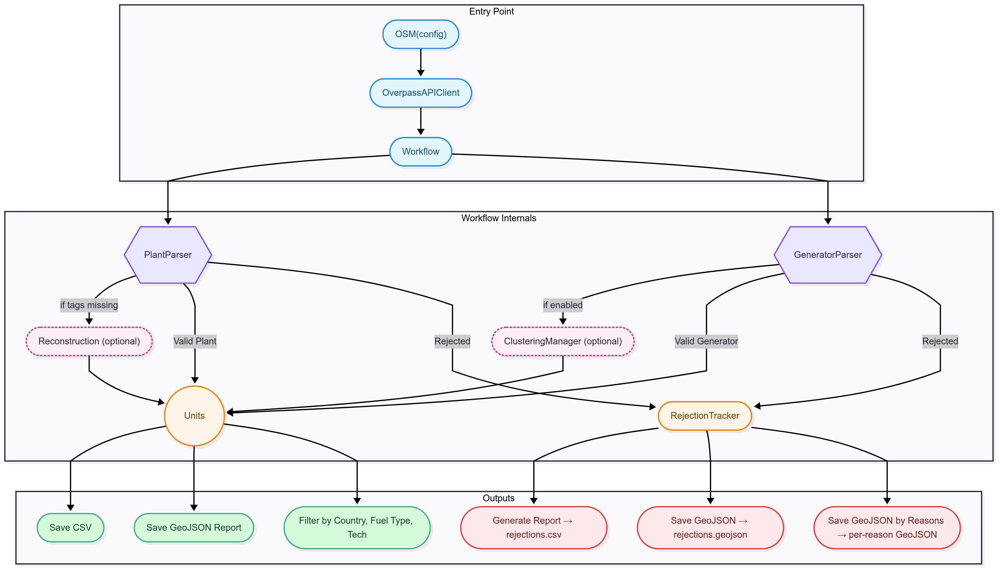

===================
OpenStreetMap (OSM) Module
===================

.. contents:: **Table of Contents**
   :local:
   :depth: 2

Overview
--------

The OpenStreetMap (OSM) module in powerplantmatching enables automated extraction, processing, and standardization of global power plant data sourced from OSM.It provides an interface for extracting, processing, and analyzing power plant data from OpenStreetMap. It offers a complete pipeline from raw OSM data to clean, standardized power plant datasets with features like capacity estimation, plant reconstruction, and quality tracking. 

As an open and community-driven geospatial platform, OSM contains a wealth of power infrastructure data, ranging from individual wind turbines and generators to multipolygon power plants. However, this data is inherently heterogeneous and often lacks key tags such as installed capacity or generation output.

The OSM module addresses these challenges by implementing a robust and configurable processing pipeline. It enhances raw OSM data with inferred capacity values, reconstructs missing plant structures, identifies and categorizes invalid or low-quality power plant entries, and outputs validated datasets in multiple formats. The module is designed to support both casual users and expert energy system modellers, providing flexibility via `config.yaml` while maintaining a clear structure for quality tracking and downstream integration.

Core features include:

- **Overpass API integration**, to programmatically retrieve plant and generator data.
- **Multi-level caching**, to reduce redundant queries and accelerate analysis.
- **Optional reconstruction and clustering**, to group standalone generators and improve completeness.
- **Export formats**, including CSV and GeoJSON for analysis and mapping.
- **Modular architecture**, designed for extension and reuse in research and planning workflows.
- **Automated rejection tracking**, for transparent data quality monitoring and reporting.

The module is fully integrated with powerplantmatching's object model and can be used through high-level functions (`OSM(config)`), custom pipelines, or interactive notebooks.

PowerPlantMatching OSM Processing Pipeline
~~~~~~~~~~~~~~~~~~~~~~~~~~~~~~~~~~~~~~~~~~

The following diagram summarizes the structure of the OSM processing pipeline:

The OSM module is structured as a modular, multi-stage pipeline that transforms raw geospatial data into validated and structured power plant entries. The process consists of three main layers:

1. **Entry Point**:
   The pipeline is typically initialized using the high-level ``OSM(config)`` function, which loads user configuration and instantiates both the Overpass API client and the ``Workflow`` manager. These components handle data retrieval and coordinate the subsequent processing steps.

2. **Workflow Internals**:
   The ``Workflow`` orchestrates two specialized parsers:

   - ``PlantParser`` extracts high-level ``power=plant`` objects.
   - ``GeneratorParser`` processes individual ``power=generator`` entries.

   Each parser classifies entries as **valid** or **rejected** based on configurable criteria (e.g., missing name, unknown technology, no source tag, etc). Optional modules can be enabled:

   - **Reconstruction**: Reconstructs plants from isolated generators lacking parent plant relations.
   - **Clustering**: Groups nearby generators of the same type into logical units.

   Valid entries are added to a ``Units`` container, while rejected ones are logged by the ``RejectionTracker`` including the reason of its rejection and associated metadata.

3. **Outputs**:
   Once processing is complete, results are exported to:

   - CSV and GeoJSON files for accepted units.
   - GeoJSON and CSV summaries for rejected elements.
   - Optional breakdowns by country, fuel type, and rejection reason.

To see complete examples of how the pipeline works in practice, refer to the following tutorial scripts in the ``analysis/`` folder:

- ``analysis/1_osm_basics.py`` – Loading, configuration, and strictness settings.
- ``analysis/2_osm_cache_and_quality.py`` – Caching system and rejection tracking.
- ``analysis/3_osm_regional_and_features.py`` – Regional downloads and feature options.
- ``analysis/4_osm_rejection_analysis.py`` – Rejection analysis and data improvement.

Alternatively, you can run the full pipeline end-to-end using the script ``run_osm_pipeline.py`` in the ``analysis/``  folder of the repository.

Key Features
~~~~~~~~~~~~

1. **Data Processing**

   - Extracts both power plants and individual generators
   - Handles nodes, ways, and relations
   - Supports complex geometries and spatial relationships

2. **Caching System**

   - Multi-level caching (API responses, processed units, CSV)
   - Config-aware cache validation
   - Efficient updates for changed data only

3. **Quality Control & Reporting**

   - Tracks 20+ types of data quality issues
   - Generates detailed rejection reports
   - Exports GeoJSON for visualization
   - Helps OSM contributors improve data

4. **Data Enhancement**

   - Estimates missing capacities using heuristics
   - Reconstructs plants from orphaned generators
   - Clusters nearby generators into logical units
   - Aggregates plant-level attributes

5. **Configuration Options**

   - Control data quality requirements
   - Enable/disable enhancement features
   - Customize source/technology mappings
   - Set region-specific parameters

Installation & Setup
--------------------

The OSM module is included with powerplantmatching. No additional installation required.

Default configuration is provided in ``powerplantmatching/package_data/config.yaml``:

.. code-block:: yaml

   OSM:
     cache_dir: null  # Uses ./osm_cache by default
     fn: osm_data.csv
     overpass_api:
       api_url: https://overpass-api.de/api/interpreter
       timeout: 1200
     missing_name_allowed: true
     missing_technology_allowed: true
     missing_start_date_allowed: true
     capacity_estimation:
       enabled: true
     units_reconstruction:
       enabled: true

Basic Usage
-----------

The simplest way to use the OSM module is through the high-level ``OSM()`` function:

.. code-block:: python

   from powerplantmatching import powerplantmatching as pm

   # Load OSM data for specific countries
   config = pm.get_config()
   config['target_countries'] = ['Luxembourg', 'Malta']

   # Get processed power plant data
   df = pm.data.OSM(config=config)

This automatically handles downloading, caching, processing, and enhancement.

Tutorials
---------

The OSM module includes tutorials demonstrating common use cases and features. These are located in the ``analysis/`` directory of the powerplantmatching repository.

Tutorial 1: OSM Basics
~~~~~~~~~~~~~~~~~~~~~~

**File:** ``analysis/1_osm_basics.py``

Learn the fundamentals of loading and configuring OSM data:

.. code-block:: python

   # Basic data loading
   config = get_config()
   config["target_countries"] = ["Luxembourg"]
   df = OSM(config=config)

   # Configure data quality requirements
   config["OSM"]["missing_name_allowed"] = False  # Reject unnamed plants
   config["OSM"]["missing_technology_allowed"] = True
   df_strict = OSM(config=config)

   # Control processing features
   config["OSM"]["capacity_extraction"]["enabled"] = True
   config["OSM"]["capacity_estimation"]["enabled"] = True
   config["OSM"]["units_clustering"]["enabled"] = False
   config["OSM"]["units_reconstruction"]["enabled"] = True

**Key concepts covered:**

- Basic data loading
- Data quality settings
- Processing features (extraction vs. estimation)
- Cache behavior (``force_refresh`` vs. ``update``)
- Multi-country loading
- Custom cache directories
- Source and technology mapping

Tutorial 2: Cache Management and Quality
~~~~~~~~~~~~~~~~~~~~~~~~~~~~~~~~~~~~~~~~

**File:** ``analysis/2_osm_cache_and_quality.py``

Work with the caching system and quality tracking:

.. code-block:: python

   # Check cache status
   show_country_coverage(
       show_missing=False,
       check_live_counts=False  # Set True to compare with live OSM
   )

   # Find outdated caches
   outdated = find_outdated_caches(
       threshold=0.95,  # Flag if <95% of current data
       check_specific_countries=["Germany", "France"]
   )

   # Populate cache for new countries
   result = populate_cache(
       countries=["Liechtenstein", "Monaco"],
       force_refresh=False,
       show_progress=True
   )

**Key concepts covered:**

- Cache structure and inspection
- Finding outdated data
- Populating new countries
- Rejection tracking
- Quality report generation

Tutorial 3: Regional Downloads and Features
~~~~~~~~~~~~~~~~~~~~~~~~~~~~~~~~~~~~~~~~~~~

**File:** ``analysis/3_osm_regional_and_features.py``

Extract data for custom regions and use reconstruction features:

.. code-block:: python

   # Download by radius
   city_region = {
       "type": "radius",
       "name": "Montevideo Area",
       "center": [-34.9011, -56.1645],
       "radius_km": 50
   }

   # Download by bounding box
   bbox_region = {
       "type": "bbox",
       "name": "Northern Uruguay",
       "bounds": [-32.5, -58.0, -30.0, -53.0]
   }

   # Download custom polygon
   result = region_download(regions=[city_region, bbox_region])

**Key concepts covered:**

- Regional downloads (not just countries)
- Multiple region types (radius, bbox, polygon)
- Reconstruction feature demonstration
- Impact analysis

Tutorial 4: Rejection Analysis for OSM Mappers
~~~~~~~~~~~~~~~~~~~~~~~~~~~~~~~~~~~~~~~~~~~~~~

**File:** ``analysis/4_osm_rejection_analysis.py``

Help improve OpenStreetMap data quality through iterative analysis:

.. code-block:: python

   # Iteration 1: Very strict configuration
   config = {
       "missing_name_allowed": False,
       "missing_start_date_allowed": False,
       "missing_technology_allowed": False,
       "capacity_extraction": {"enabled": False},
       "capacity_estimation": {"enabled": False}
   }

   # Process and track rejections
   rejection_tracker = RejectionTracker()
   units = Units()
   workflow.process_country_data("Chile")

   # Export analysis results
   rejection_tracker.save_geojson_by_reasons("output/rejection_maps/")
   rejection_tracker.generate_report().to_csv("output/chile_issues.csv")

**Key concepts covered:**

- Iterative refinement process
- Rejection analysis workflow
- Export formats for OSM editors
- Contribution guidelines
- Data quality improvement workflow

Features in Detail
------------------

Capacity Estimation
~~~~~~~~~~~~~~~~~~~

When capacity data is missing, the module can estimate it based on:

- Plant/generator type and size
- Area calculations for solar farms
- Technology-specific heuristics
- Regional capacity factors

.. code-block:: python

   config["OSM"]["capacity_estimation"]["enabled"] = True
   # Method is configured per source in the sources section
   config["OSM"]["sources"]["Solar"]["capacity_estimation"] = {
       "method": "area_based",
       "efficiency": 150  # W/m²
   }

Plant Reconstruction
~~~~~~~~~~~~~~~~~~~~

Reconstructs complete plants from incomplete data:

- Groups orphaned generators within plant boundaries
- Aggregates attributes from members
- Handles missing plant relations
- Creates synthetic plant entries

.. code-block:: python

   config["OSM"]["units_reconstruction"]["enabled"] = True
   config["OSM"]["units_reconstruction"]["min_generators_for_reconstruction"] = 2

Generator Clustering
~~~~~~~~~~~~~~~~~~~~

Groups nearby generators into logical units:

- Distance-based clustering using DBSCAN or K-means
- Technology-aware grouping
- Configurable thresholds
- Preserves individual generator data

.. code-block:: python

   config["OSM"]["units_clustering"]["enabled"] = True
   config["OSM"]["sources"]["Solar"]["units_clustering"] = {
       "method": "dbscan",
       "eps": 0.005,
       "min_samples": 2
   }

Quality Tracking
~~~~~~~~~~~~~~~~

The rejection tracking system provides detailed insights:

**Rejection Reasons:**

- ``MISSING_NAME_TAG`` - No name attribute
- ``MISSING_TECHNOLOGY_TAG`` - No technology specified
- ``CAPACITY_ZERO`` - Capacity parses to zero
- ``COORDINATES_NOT_FOUND`` - Missing location data
- ``WITHIN_EXISTING_PLANT`` - Generator inside plant boundary
- And 15+ more specific reasons

**Analysis Outputs:**

- GeoJSON files for visualization
- CSV reports with full details
- Summary statistics
- Recommendations for fixes

API Reference
-------------

Main Functions
~~~~~~~~~~~~~~

.. code-block:: python

   # High-level interface
   OSM(config=None, update=False, raw=False)

   # Country processing
   process_countries(countries, csv_cache_path, cache_dir,
                    update, osm_config, target_columns, raw=False)

   # Regional downloads
   region_download(regions, download_type='both',
                  update_country_caches=True)

   # Cache management
   show_country_coverage(cache_dir=None, show_missing=False,
                        check_live_counts=False)
   populate_cache(countries, cache_dir=None, force_refresh=False)

Key Classes
~~~~~~~~~~~

.. code-block:: python

   # Data models
   Unit          # Power plant/generator data structure
   Units         # Collection of units with statistics
   PlantGeometry # Spatial representation

   # Processing
   Workflow      # Main processing pipeline
   PlantParser   # Extract plant data
   GeneratorParser # Extract generator data

   # Quality
   RejectionTracker # Track and analyze rejections
   RejectedElement  # Single rejection record

Configuration Options
---------------------

The OSM module supports extensive configuration through ``config.yaml``:

.. code-block:: yaml

   OSM:
     # Cache settings
     cache_dir: ~/osm_caches/global  # Custom cache location
     fn: osm_data.csv                # CSV filename

     # API settings
     overpass_api:
       api_url: https://overpass-api.de/api/interpreter
       timeout: 1200
       max_retries: 3
       retry_delay: 60
       show_progress: true

     # Data quality requirements
     missing_name_allowed: true
     missing_technology_allowed: false
     missing_start_date_allowed: true
     plants_only: true  # Set false to also process generators

     # Enhancement features
     capacity_extraction:
       enabled: true
       # Additional regex patterns can be configured

     capacity_estimation:
       enabled: true

     units_clustering:
       enabled: false

     units_reconstruction:
       enabled: true
       min_generators_for_reconstruction: 2
       name_similarity_threshold: 0.7

     # Tag mappings
     source_mapping:
       Solar: [solar, photovoltaic, solar_thermal, pv]
       Wind: [wind, wind_power, wind_turbine]
       Natural Gas: [gas, natural_gas, lng]

     technology_mapping:
       PV: [photovoltaic, solar_pv, pv]
       CCGT: [combined_cycle, ccgt, natural_gas_cc]
       OCGT: [open_cycle, ocgt, natural_gas_oc]

     # Source-specific configuration
     sources:
       Solar:
         units_clustering:
           method: dbscan
           eps: 0.005
           min_samples: 2
         capacity_estimation:
           method: area_based
           efficiency: 150  # W/m²
       Wind:
         units_clustering:
           method: dbscan
           eps: 0.02
           min_samples: 2

Best Practices
--------------

1. **Start with small countries** for testing (Luxembourg, Malta, Cyprus)
2. **Use custom cache directories** for large projects
3. **Enable live count checking** periodically to find outdated data
4. **Run rejection analysis** to understand data quality
5. **Configure mappings** for regional tagging conventions
6. **Balance quality vs. coverage** based on your needs

Contributing to OSM Data Quality
--------------------------------

The OSM module helps identify data quality issues that can be fixed in OpenStreetMap. There are two main ways to contribute improvements:

**Manual review using rejection outputs**:

    1.Run rejection analysis on your region.
    2.Review the generated GeoJSON files in JOSM or iD editor.
    3.Common fixes needed:

        -Add capacity tags: ``plant:output:electricity=50 MW``
        -Add names tags: ``name=Central Hidroeléctrica Rapel``
        -Add technology tags: ``plant:method=water-storage``, ``plant:method=wind_turbine``
        -Add dates tags: ``start_date=1968``

    4. Re-run analysis to verify improvements

**Interactive mapping via MapYourGrid**:

    1.Visit the `MapYourGrid Improve Tags Tool <https://mapyourgrid.org/tools/#improve-osm-tags-with-ppm>`_.
    2.This tool offers a visual interface for exploring rejected power plant data, using the output from powerplantmatching rejection reports.
    3.You can easily download the rejected data in a geojson format for a given country worldwide and use it as a hint layer in JOSM to improve the power  plants tags directly in OSM.

Performance Considerations
--------------------------

- Initial country downloads can be slow (use ``populate_cache()`` overnight)
- The complete cache for all countries is ~6GB
- Use ``plants_only=True`` if you don't need generator-level data
- Regional downloads are faster than full country extracts
- Cache validation uses config hashing for efficiency

Troubleshooting
---------------

**Common Issues:**

1. **Slow downloads**: The Overpass API has rate limits. Use cached data when possible.
2. **Missing data**: Check rejection reports to understand why elements were filtered.
3. **Memory usage**: Process countries individually for large analyses.
4. **Outdated cache**: Use ``force_refresh=True`` or check with ``find_outdated_caches()``.

**Debug Logging:**

.. code-block:: python

   import logging
   logging.basicConfig(level=logging.DEBUG)

   # Now OSM operations will show detailed progress

See Also
--------

- :doc:`basics` - General powerplantmatching concepts
- :doc:`api-data` - Data processing API reference
- `OpenStreetMap Wiki - Power Generation <https://wiki.openstreetmap.org/wiki/Power_generation>`_
- `Overpass API Documentation <https://wiki.openstreetmap.org/wiki/Overpass_API>`_
