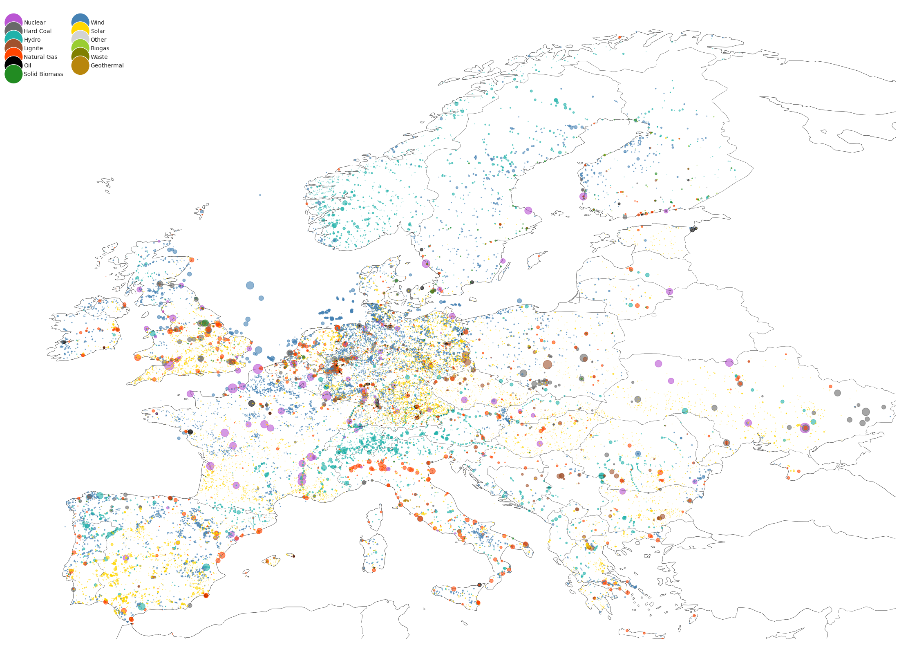

# Getting Started

This guide will help you get started with Powerplantmatching.

## Installation

Instructions for installing Powerplantmatching.

## Usage

Basic usage examples and tips.

# Get the Data

To directly load the already built data into a pandas dataframe, just call:

```python
import powerplantmatching as pm
pm.powerplants(from_url=True)
```

This will parse and store the [actual dataset of powerplants of this repository](https://github.com/PyPSA/powerplantmatching/blob/master/powerplants.csv).
Setting `from_url=False` (default) will load all the necessary data files and combine them. Note that this might take some minutes.

The resulting dataset compared with the capacity statistics provided by the [ENTSOE SO&AF](https://data.open-power-system-data.org/national_generation_capacity/2019-02-22):



The merged data is also available as a bigger dataset which provides the original data entries:

```python
pm.powerplants(reduced=False)
```

It links the entries of the matched power plants and lists all the related properties given by the different data-sources.

> **Note**
>
> Calling the function with `reduced=False` will trigger the matching process which requires **Java** to be installed on your system. Please ensure that you have Java installed and that it is in your system's PATH.
>
> You can download and install Java from the official website: https://www.java.com/en/download/
>
> If Java is not installed or not in your system's PATH, you may encounter runtime errors.
